# TOURLIST

**: 모든 투어리스트(Tourist)를 위한 단 하나의 투어리스트(TourList)✈✅**

## ✈ 프로젝트 소개

> **개발 기간**: 2024.04.09~2024.05.20 (약 6주)  
> **개발 인원**: 6인 (프론트엔드 2인 + 백엔드 4인)  
> **배포 URL**: [tourlist.me](https://tourlist.me/)


 | 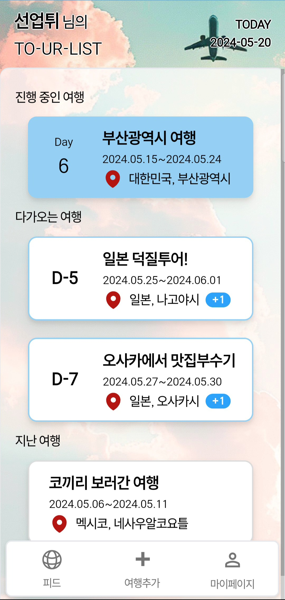 | 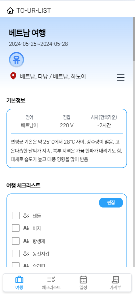

TOURLIST는 여행에 필요한 체크 리스트, 일정, 가계부를 쉽게 관리하도록 돕는 통합 관리 서비스입니다.

-   여행 장소와 활동을 바탕으로 체크리스트가 자동으로 생성되고, 함께 가는 멤버들과 공유할 수 있습니다.
-   원화와 현지 화폐 지출을 통합한 가계부 기능을 통해 여행에 대한 예산 관리가 쉬워집니다.

### 배경 및 목적

여행을 위해서는 필수적이지만 번거로운 일이 많습니다. 여행 전에는 매번 비슷하지만 다른 준비물을 챙겨야 하고, 여행 중에는 적절한 예산 관리가 필요합니다. 특히 해외 여행의 경우, 기후와 화폐 등 다른 것들이 많기 때문에 여행을 위해 신경 써야 할 것들이 더 늘어납니다.

이러한 번거로움과 불편함을 없애고, 여행을 더 간편하게 만들고자 TOURLIST 서비스를 기획했습니다.

### 타겟

-   해외 여행을 준비하는 한국인 여행자
-   단체로 여행을 준비하는 한국인 여행자
-   여행 예산을 관리하고 싶은 여행자

### 차별점

-   다른 여행 앱들과 달리 모바일 기반 웹서비스로, 어떤 플랫폼으로든 접근하여 사용할 수 있습니다. 특히 PWA를 이용해 어플을 설치하여 쉽게 사용할 수도 있습니다.
-   기존 서비스는 주요 국가 및 한정된 도시 정보를 제공하였지만 TOURLIST에서는 203개국 나라정보와 208개의 화폐 정보를 제공합니다.
-   국가 및 활동에 대해 필요한 준비물을 자동으로 추가 제공합니다.

### 주요 기능

-   나라/활동 별 준비물 체크리스트 생성
    -   국가 기본 정보와 전력 및 여행에 도움에 되는 정보 제공
    -   기본적으로 여행에 필요한 준비물 체크리스트를 나라별로 제공
    -   여행에서 계획한 활동 기반으로 필요한 준비물을 업데이트
    -   사용자가 원하는 체크리스트 항목 추가/수정/삭제 가능
-   멤버들과 함께 여행 일정 실시간 계획
    -   여행을 함께 갈 멤버 추가 가능
    -   수정된 여행 일정은 모든 멤버에게 실시간 업데이트
    -   일정별 장소 선택 가능
    -   장소 선택시 활동 지정 가능
-   공동/개인 가계부 작성
    -   환율 정보 제공
    -   현지 통화 지출 내역을 원화로 환산하여 제공
    -   공동 지출 내역 기록 가능
    -   공동 지출 내역을 바탕으로 여행 내 정산 내역(누가 누구에게 얼마를 보내야하는지) 제공

## ⛑개발환경
### IDE


### Management Tool


### Frontend


### Backend


### Infra


### 외부 API


## 📱 서비스 화면 및 기능

> PWA를 활용한 모바일 친화적 웹으로, 모바일 세로 모드에 맞춰 화면을 설계했습니다.

### 로그인 / 회원가입 화면

|  |
| ---------------------------------------------------------------- |
| 로그인 및 회원가입                                               |

-   구글 로그인을 통해 회원가입/로그인이 진행됩니다.
-   회원가입 시 이름, 닉네임, 생년월일, 성별을 입력해야 합니다.
    -   닉네임은 중복을 허용하지 않으며, 사용자를 구별하는데 사용됩니다.

### 메인 화면

| 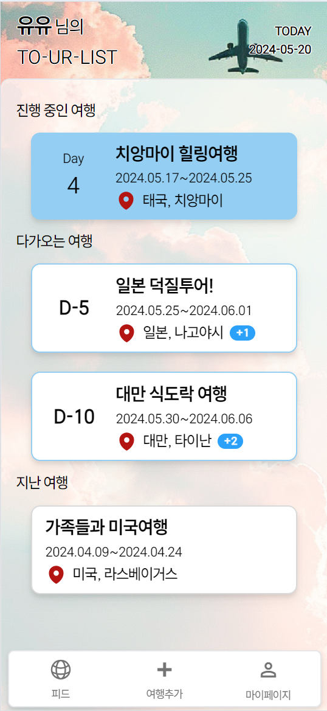 |
| ------------------------------------------------------------------- |
| 메인 화면: 투어 리스트                                              |

-   현재 날짜와 자신의 여행 리스트 화면을 볼 수 있습니다.
-   현재 진행 중인 여행이 최상단에 보이며, 그 다음은 다가오는 여행, 지난 여행 순으로 리스트가 보입니다.
    -   다가오는 여행은 여행까지 남은 날짜 오름차순으로, 지난 여행은 최신순으로 정렬되어 있습니다.
-   하단 내비게이션 탭 바를 통해 다른 페이지로 이동할 수 있습니다.

### 여행 추가 화면

|  |
| ---------------------------------------------------------------------- |
| 여행 추가                                                              |

-   하단 내비게이션 바의 ‘추가’ 버튼을 누르면 여행을 추가할 수 있습니다.
-   여행을 떠날 도시, 여행을 떠날 날짜, 여행 제목을 입력하여 여행을 생성합니다.
    -   기본 여행 제목은 `(도시명) 여행`입니다. (예시: 파리 여행)
-   생성한 사용자는 여행의 ‘호스트’가 되어 여행 삭제와 멤버 관리가 가능해집니다.

### 여행 메인 화면

|  |
| ------------------------------------------------------------------- |
| 여행 메인 화면                                                      |

-   특정 여행을 클릭하여 볼 수 있는 화면으로, 여행의 세부정보를 확인할 수 있습니다.
-   생성한 여행에 대한 정보(여행 제목, 날짜, 멤버, 도시)를 상단에서 확인할 수 있습니다.
-   여행하는 나라에 대한 기본정보(언어, 전압, 시차, 기후)를 확인할 수 있습니다.
-   햄버거 버튼을 통해 여행을 편집하거나 여행 나가기 / 여행 삭제를 할 수 있습니다.
    -   나가기의 경우 여행 내용은 유지한 채, 자신의 여행 리스트에서 해당 여행을 삭제합니다.
    -   삭제의 경우 여행의 호스트만 가능하며, 여행 자체가 삭제되어 모든 멤버들의 여행 리스트에서 해당 여행이 삭제됩니다.

### 여행 편집 화면

| 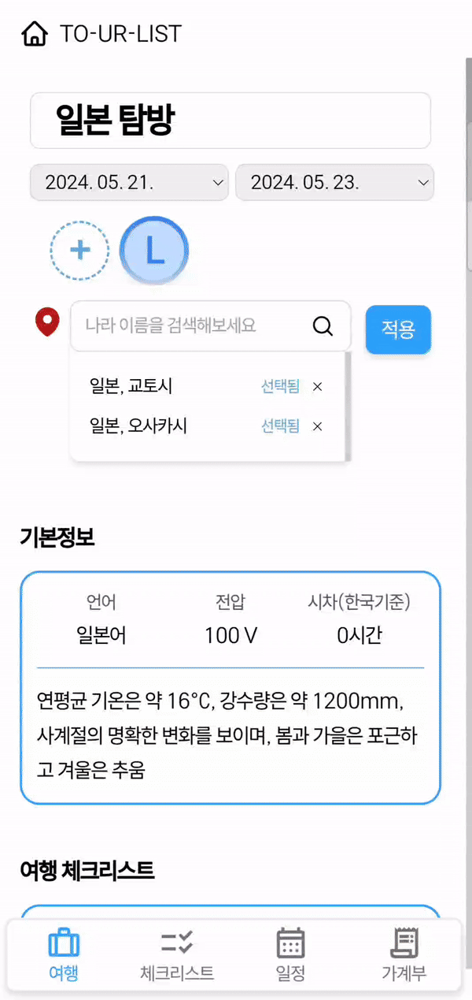 |  |  |
| ----------------------------------------------------------------------------- | ------------------------------------------------------------------------------ | ----------------------------------------------------------------------------- |
| 여행 편집                                                                     | 멤버 및 고스트 멤버 추가                                                       | 고스트 멤버 전환                                                              |

-   여행을 떠날 도시, 여행을 떠날 날짜, 여행 제목을 수정할 수 있습니다.
-   여행을 함께 떠날 멤버를 추가할 수 있습니다.
    -   서비스를 이용하는 사용자라면, 사용자 검색을 통해 추가할 수 있습니다.
    -   서비스를 이용하지는 않지만, 이름이 추가해두고 싶다면 ‘고스트’ 멤버로 추가할 수 있습니다.
        -   고스트는 여행 멤버를 단순히 기록해두거나 정확한 정산을 위해 추가할 수 있습니다.
        -   고스트 닉네임은 해당 여행 내에서 중복을 허용하지 않으며, 등록된 고스트는 나중에 실제 멤버로 전환이 가능합니다.

### 여행 체크리스트 화면

|  |  |
| ------------------------------------------------------------------- | ----------------------------------------------------------------------- |
| 체크리스트 목록 (전체/일정별) 및 체크                               | 체크리스트 추가 및 편집                                                 |

-   여행에서 챙겨야 하는 모든 체크리스트와, 일정별 체크리스트를 확인할 수 있습니다.
-   편집을 누르면 체크리스트에 항목을 추가하고 수정하고 삭제할 수 있습니다.
-   항목 추가
    -   기본적으로는 항목은 본인에게만 추가됩니다.
    -   모두에게 추가한 경우, 추가한 아이템이 모든 멤버들에게 추가됩니다.
-   항목 수정
    -   항목의 내용을 추가할 수 있습니다.
    -   항목이 사용되는 장소/활동을 추가할 수 있습니다.
-   항목 삭제
    -   항목 삭제 시 되돌릴 수 없다는 것을 고지하는 경고창이 나타납니다.

### 여행 일정 화면

| 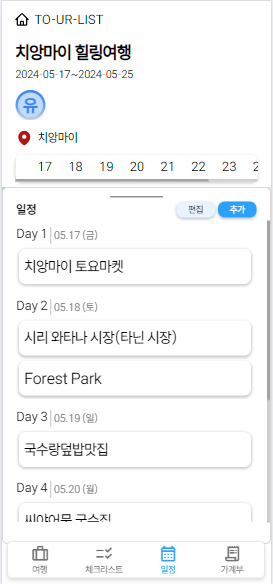 |  | 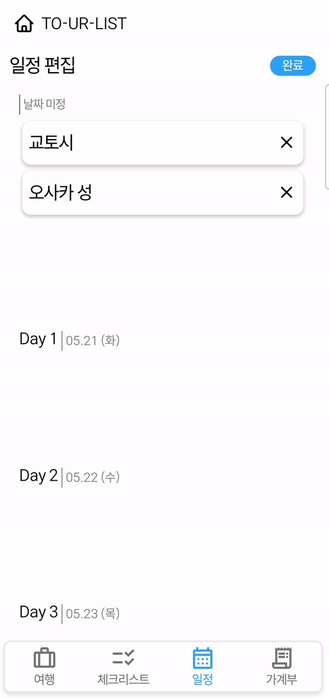 |  |
| --------------------------------------------------------------- | ------------------------------------------------------------------- | -------------------------------------------------------------------- | ------------------------------------------------------------------------ |
| 일정 목록 확인                                                  | 일정 추가 및 장소 검색                                              | 일정 편집                                                            | 활동 편집                                                                |

-   정해진 일정을 지도와 함께 확인할 수 있습니다.
    -   일정의 경우 전체 일정을 볼 수 있고, 특정 날짜의 일정도 확인 가능합니다.
-   장소를 검색하여 일정을 추가할 수 있습니다.
-   장소에 대한 상세 정보를 보고, 장소에 대한 활동 추가나 장소 방문 일정 수정이 가능합니다.
-   활동을 추가하면, 활동에 필요한 아이템이 체크리스트에 자동으로 추가됩니다.

### 여행 가계부 화면

| 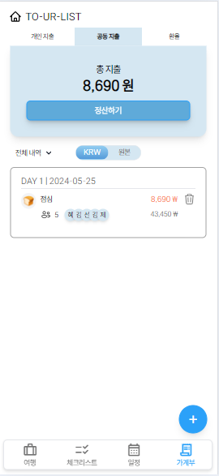 |  | 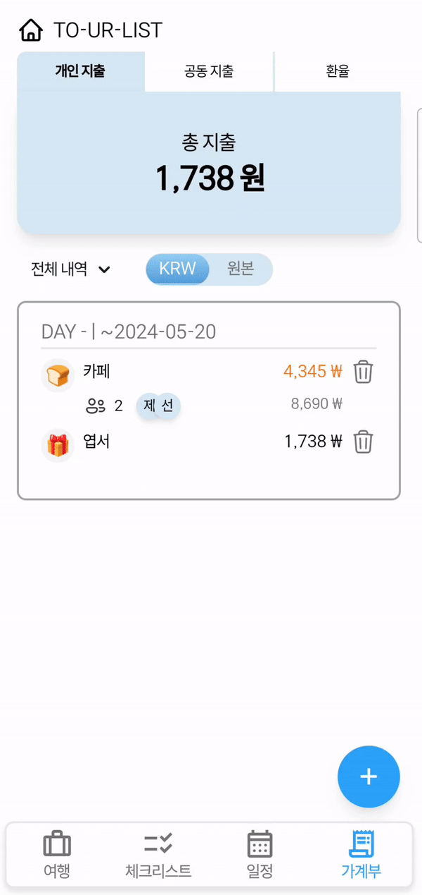 | 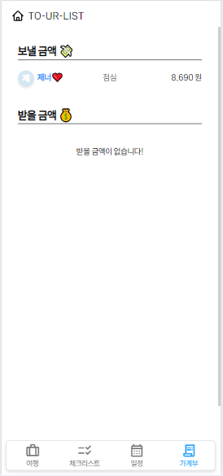 |
| ----------------------------------------------------------------- | --------------------------------------------------------------------- | ---------------------------------------------------------------------- | ----------------------------------------------------------------------- |
| 가계부                                                            | 지출 추가                                                             | 지출 편집                                                              | 지출 정산                                                               |

-   지출 목록을 확인하고, 지출 내역을 추가하거나 편집할 수 있습니다.
-   총 지출 내역은 원화/ 현지 화폐로 변경하여 확인할 수 있습니다.
-   지출 목록은 엑셀 파일로 내보낼 수 있습니다.
-   지출 등록시 개인 지출과 공동 지출을 선택할 수 있습니다.
-   공동 지출시 결제에 참여한 여행 멤버를 선택할 수 있습니다.
-   공동 지출의 경우, 각 멤버에게 얼마를 받고, 얼마를 보내야하는지 정산할 수 있습니다.

### 마이 페이지 화면

|  |
| ----------------------------------------------------------------------- |
| 마이페이지 및 회원정보 수정                                             |

-   회원정보(닉네임, 이름, 생년월일, 성별)을 확인하고 편집할 수 있습니다.
-   로그아웃이 가능합니다.
-   사용자가 피드에 게시하거나 좋아요를 누른 여행을 확인할 수 있습니다.
-   최하단에 회원탈퇴 버튼을 통해 회원탈퇴가 가능합니다.

## ⚙ 기술 소개

### 기술 선정 이유

-   **WebSocket** : 여행 일정 정보의 경우 모두가 동시에 공유하고 수정할 수 있어야 한다고 판단했고, 서버와의 양방향 통신을 통해 실시간으로 업데이트되는 정보를 모두 공유 가능한 WebSocket 통신이 이 일에 가장 적합하다고 판단했습니다.
-   **구글 맵 API** : 여행 일정을 만드는 과정에서 여행 가는 곳의 위치나 여행지의 정보를 받아올 필요가 있었고, 여행 어플이라 전 세계가 대상인 만큼, 전 세계의 정보를 가장 많이 제공하는 구글 맵 API를 이용해 여행 정보를 받아오고 출력하였습니다.
-   **PWA** : 웹 페이지를 모바일 네이티브 어플리케이션처럼 사용 가능하게 해주는 웹 앱으로, 모바일 환경에서 사용할 가능성이 높은 우리 서비스를 좀 더 편리하게 사용할 수 있도록 모바일 앱 같은 환경을 제공하는데 적합하다는 생각을 하였습니다.
-   **React** : 메타에서 개발한 JavaScript 라이브러리로, 손쉬운 컴포넌트 재사용성과 SPA 구성을 통한 서비스 최적화에 유리하여 프론트엔드 분야에서 채택하였습니다.
-   **TypeScript** : 마이크로소프트에서 개발한 JavaScript의 슈퍼셋 프로그래밍 언어로, 기존 JavaScript의 동적 타이핑으로 발생 가능한 문제를 사전에 방지해 주어 코드 자동 완성, 오류 검출 등을 더 효율적으로 수행 가능해 채택하였습니다.
-   **Neo4j**: 관계형 데이터베이스에서 복잡한 join을 통해 조회해야 하는 데이터를 직관적으로 사용하고 활용하기 위해 사용했습니다. 특히 시각적으로 관계를 확인할 수 있어 추후에 서비스를 확장할 때, 기존 데이터 분석에 용이하다고 판단했습니다.

### MSA

-   MicroService Architecture:
    -   MircroService Architecture를 도입하여 각 서비스가 독립적으로 운영되고 배포되게끔 구성했습니다.
-   Event Driven Architecture:
    -   각 서비스 간의 상호작용을 위해 Kafka를 활용한 Event Driven Architecture를 도입했습니다.
-   Hexagonal Architecture:
    -   REST API를 이용한 요청이 오기도 하지만, 메시징 큐를 이용한 요청이 오기도 하는 만큼, 비즈니스 로직과 외부 어플리케이션을 분리하는 Hexagonal Architecture를 적용했습니다.

## 📜 설계 문서

### 아키텍쳐 구조

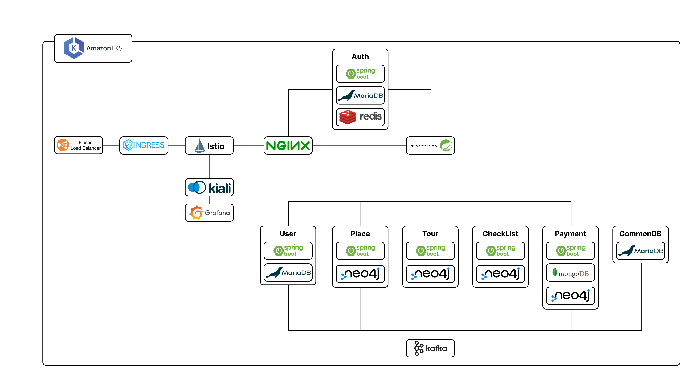

### API 명세

| 분류            | 필터    | 설명                           | URI                                            | Request                                                                                                                                                                                                                                                                                                                       | Response                                                                                                                                                                                                                                                                                                                                                  |
| --------------- | ------- | ------------------------------ | ---------------------------------------------- | ----------------------------------------------------------------------------------------------------------------------------------------------------------------------------------------------------------------------------------------------------------------------------------------------------------------------------- | --------------------------------------------------------------------------------------------------------------------------------------------------------------------------------------------------------------------------------------------------------------------------------------------------------------------------------------------------------- |
| 여행-체크리스트 | PUT     | 체크리스트 항목 체크/체크 해제 | /checklist/check                               | { tourId : String, placeId : String, activity : String, tourDay : Number, item : String, isChecked: Boolean }                                                                                                                                                                                                                 |                                                                                                                                                                                                                                                                                                                                                           |
| 여행-체크리스트 | POST    | 체크리스트 공동 항목 추가      | /checklist/public                              | { tourId : String, placeId : String, activity : String, tourDay : Number, item : String, isChecked: Boolean }                                                                                                                                                                                                                 | { isDuplicated: Boolean }                                                                                                                                                                                                                                                                                                                                 |
| 여행-체크리스트 | GET     | 여행 체크 리스트 조회          | /checklist/{tourId}                            |                                                                                                                                                                                                                                                                                                                               | [ { tourId : String, placeId : String, activity : String, tourDay : Number, item : String, isChecked: Boolean isPublic: Boolean }, … ]                                                                                                                                                                                                                    |
| 여행-체크리스트 | DELETE  | 체크 리스트 항목 삭제          | /checklist/item                                | { tourId : String, placeId : String, activity : String, tourDay : Number, item : String, isChecked: Boolean }                                                                                                                                                                                                                 |                                                                                                                                                                                                                                                                                                                                                           |
| 여행-체크리스트 | PUT     | 체크 리스트 항목 수정          | /checklist/item                                | { oldItem : { tourId : String, placeId : String, activity : String, tourDay : Number, item : String, isChecked: Boolean }, newItem : { tourId : String, placeId : String, activity : String, tourDay : Number, item : String, isChecked: Boolean } }                                                                          | { isDuplicated: Boolean }                                                                                                                                                                                                                                                                                                                                 |
| 여행-체크리스트 | POST    | 체크 리스트 개인 항목 추가     | /checklist/private                             | { tourId : String, placeId : String, activity : String, tourDay : Number, item : String, isChecked: Boolean }                                                                                                                                                                                                                 | { isDuplicated: Boolean }                                                                                                                                                                                                                                                                                                                                 |
| 여행-장소/활동  | GET     | 장소 리스트 조회               | /place/{tourId}                                |                                                                                                                                                                                                                                                                                                                               | [ { placeId : String, placeName : String, tourDay : Number, tourPlaceId : String, activityList : [ String, … ] }, … ]                                                                                                                                                                                                                                     |
| 여행-장소/활동  | Message | 장소 변경사항                  | /place/{tourId}                                |                                                                                                                                                                                                                                                                                                                               | { type : UPDATE_PLACE, body : { tourId : String, placeList : [ { placeId : String, placeName : String, tourDay : Number, tourPlaceId : String, activityList : [ String, … ] }, … ] } }                                                                                                                                                                    |
| 여행-장소/활동  | Message | 활동 삭제                      | /place/{tourId}                                | { type : DELETE_ACTIVITY, body : { tourPlaceId : String, activity : String } }                                                                                                                                                                                                                                                | { type: DELETE_ACTIVITY, isSuccess : Boolean, body : { userId : String(UUID) } }                                                                                                                                                                                                                                                                          |
| 여행-장소/활동  | Message | 활동 추가                      | /place/{tourId}                                | { type : ADD_ACTIVITY, body : { tourId: String, placeId : String, tourDay : Number, activity : String, } }                                                                                                                                                                                                                    | { type: ADD_ACTIVITY, isSuccess : Boolean, body : { userId: String(UUID) } }                                                                                                                                                                                                                                                                              |
| 여행-장소/활동  | GET     | 장소 상세 정보 조회            | /place/{tourId}/{tourDay}/{placeId}            |                                                                                                                                                                                                                                                                                                                               | { placeInfo : { placeName : String, placePrimaryType : String, placeLatitude : Number, placeLongitude : Number, placeAddress : String, placeWeekdayDescriptions : [ String, … ], paymentOptions : { acceptsCreditCards : Boolean, acceptsCashOnly : Boolean }, placePhotoList : [ placePhoto, … ] }, activityList : [ String, … ], isSelected : Boolean } |
| 여행-장소/활동  | Message | 장소 날짜 수정                 | /place/{tourId}                                | { type : UPDATE_PLACE_DATE, body : { tourId : String, placeId : String, placeName : String, oldTourDay : Number, newTourDay : Number } }                                                                                                                                                                                      | { type: UPDATE_PLACE_DATE, isSuccess : Boolean, body : { userId: String(UUID) } }                                                                                                                                                                                                                                                                         |
| 여행-장소/활동  | Message | 장소 삭제                      | /place/{tourId}                                | { type : DELETE_PLACE, body : { tourId : String, placeId : String, placeName : String, tourDay : Number } }                                                                                                                                                                                                                   | { type: DELETE_PLACE, isSuccess : Boolean, body : { userId: String(UUID) } }                                                                                                                                                                                                                                                                              |
| 여행-장소/활동  | Message | 장소 추가                      | /place/{tourId}                                | { type: ADD_PLACE, body : { tourId : String, placeId : String, placeName : String, tourDay : Number } }                                                                                                                                                                                                                       | { type: ADD_PLACE, isSuccess : Boolean, body : { userId: String(UUID) } }                                                                                                                                                                                                                                                                                 |
| 여행-장소/활동  | GET     | 장소 검색                      | /place/search/{keyword}/{longitude}/{latitude} |                                                                                                                                                                                                                                                                                                                               | [ { placeId : String, placeName : String, placePrimaryType : String, placeLatitude : Number, placeLongitude : Number, placeAddress : String, placePhotoList : [ placePhoto, … ] }, … ]                                                                                                                                                                    |
| 여행-장소/활동  | GET     | 활동 리스트 조회               | /activity/{placeId}                            |                                                                                                                                                                                                                                                                                                                               | [ String, …]                                                                                                                                                                                                                                                                                                                                              |
| 여행-가계부     | GET     | 지출 내역 상세 조회            | /payment/{tourId}/{payId}?payType              |                                                                                                                                                                                                                                                                                                                               | { payType: String, tourId: String, payAmount: Number, exchangeRate: Double, unit: String, currencyCode: String, payMethod: String, payDatetime: Date, payContent: String, payCategory: String, payerId : String(UUID), payMemberList : [ { userId: String(UUID), payAmount: Number }, … ] }                                                               |
| 여행-가계부     | GET     | 지출 내역 리스트 조회          | /payment/{tourId}                              |                                                                                                                                                                                                                                                                                                                               | [ { payId : String, payType: String, tourId: String, payAmount: Number, exchangeRate: Double, unit: String, currencyCode: String, payMethod: String, payDatetime: Date, payContent: String, payCategory: String, payerId : String(UUID), payMemberList : [ { userId: String(UUID), payAmount: Number }, … ] }, … ]                                        |
| 여행-가계부     | DELETE  | 지출 항목 삭제                 | /payment/{tourId}/{payId}?payType              |                                                                                                                                                                                                                                                                                                                               |                                                                                                                                                                                                                                                                                                                                                           |
| 여행-가계부     | PUT     | 지출 항목 수정                 | /payment/{payId}                               | { payType: String, tourId: String, payAmount: Number, exchangeRate: Double, unit: String, currencyCode: String, payMethod: String, payDatetime: Date, payContent: String, payCategory: String, payerId : String(UUID), payMemberList : [ { userId: String(UUID), payAmount: Number }, … ] }                                   |                                                                                                                                                                                                                                                                                                                                                           |
| 여행-가계부     | POST    | 지출 항목 추가                 | /payment                                       | { payType: String, tourId: String, payAmount: Number, exchangeRate: Double, unit: String, currencyCode: String, payMethod: String, payDatetime: Date, payContent: String, payCategory: String, payerId : String(UUID), payMemberList : [String(UUID), …] payMemberList : [ { userId: String(UUID), payAmount: Number }, … ] } | { payId: String }                                                                                                                                                                                                                                                                                                                                         |
| 여행-가계부     | GET     | 날짜별 화폐 환율 조회          | /payment/currency/{countryCode}/{date}         |                                                                                                                                                                                                                                                                                                                               | { unit : String, currencyRate : Number currencyCode: String }                                                                                                                                                                                                                                                                                             |
| 여행-멤버       | PUT     | 여행 고스트 멤버 닉네임 변경   | /tour/member/ghost                             | { tourId : String, ghostId : String, ghostNickname : String }                                                                                                                                                                                                                                                                 |                                                                                                                                                                                                                                                                                                                                                           |
| 여행-멤버       | POST    | 여행 고스트 멤버 교체          | /tour/member/resurrection                      | { tourId : String, ghostId : String, ghostNickname : String, userId: String(UUID), userNickname : String }                                                                                                                                                                                                                    |                                                                                                                                                                                                                                                                                                                                                           |
| 여행-멤버       | GET     | 멤버 조회                      | /tour/member/{tourId}                          |                                                                                                                                                                                                                                                                                                                               | [ { userId : String(UUID), userNickname: String, userName: String, memberType: String }, … ]                                                                                                                                                                                                                                                              |
| 여행-멤버       | POST    | 여행 고스트 멤버 추가          | /tour/member/ghost                             | { tourId : String, ghostNickname : String }                                                                                                                                                                                                                                                                                   | { ghostId : String, ghostNickname : String }                                                                                                                                                                                                                                                                                                              |
| 여행-멤버       | GET     | 유저 검색                      | /user/{userNickname}                           |                                                                                                                                                                                                                                                                                                                               | [ { userId: String(UUID), userName: String, userNickname: String }, … ]                                                                                                                                                                                                                                                                                   |
| 여행-멤버       | DELETE  | 여행 멤버 추방                 | /tour/member                                   | { tourId : String, userId : String(UUID), userNickname : String, memberType: String }                                                                                                                                                                                                                                         |                                                                                                                                                                                                                                                                                                                                                           |
| 여행-멤버       | POST    | 여행 멤버 추가                 | /tour/member                                   | { tourId : String, userId: String(UUID), userNickname : String }                                                                                                                                                                                                                                                              |                                                                                                                                                                                                                                                                                                                                                           |
| 여행-관리       | POST    | 피드 기존 여행으로 가져오기    | /feed/{feedId}/{tourId}                        |                                                                                                                                                                                                                                                                                                                               | { tourId: String }                                                                                                                                                                                                                                                                                                                                        |
| 여행-관리       | GET     | 나라별 도시 리스트 조회        | /country/city/{countryCode}                    |                                                                                                                                                                                                                                                                                                                               | [String, …]                                                                                                                                                                                                                                                                                                                                               |
| 여행-관리       | GET     | 나라 리스트 조회               | /country                                       |                                                                                                                                                                                                                                                                                                                               | [ { countryName : String, countryCode : String }, … ]                                                                                                                                                                                                                                                                                                     |
| 여행-관리       | PUT     | 여행 호스트 권한 위임          | /tour/host                                     | { tourId : String, userId: String(UUID), userNickname : String }                                                                                                                                                                                                                                                              |                                                                                                                                                                                                                                                                                                                                                           |
| 여행-관리       | DELETE  | 여행 나가기                    |                                                | { tourId : String }                                                                                                                                                                                                                                                                                                           |                                                                                                                                                                                                                                                                                                                                                           |
| 여행-관리       | GET     | 내 여행 리스트 조회            | /tour                                          |                                                                                                                                                                                                                                                                                                                               | [ { tourId : String, tourTitle : String, cityList : [ { countryCode : String, cityName : String }, … ], startDate : Date, endDate : Date }, … ]                                                                                                                                                                                                           |
| 여행-관리       | GET     | 여행 세부정보 조회             | /tour/{tourId}                                 |                                                                                                                                                                                                                                                                                                                               | { tourTitle : String, cityList : [ { countryCode : String, cityName : String }, … ], startDate : Date, endDate : Date memberList : [ { userId : String(UUID), userNickname : String, userName : String, memberType : String, }, … ], }                                                                                                                    |
| 여행-관리       | DELETE  | 여행 삭제                      | /tour/{tourId}                                 |                                                                                                                                                                                                                                                                                                                               |                                                                                                                                                                                                                                                                                                                                                           |
| 여행-관리       | PUT     | 여행 도시 수정                 | /tour/city                                     | { tourId : String, cityList : [ { countryCode : String, cityName : String }, … ] }                                                                                                                                                                                                                                            |                                                                                                                                                                                                                                                                                                                                                           |
| 여행-관리       | PUT     | 여행 기간 수정                 | /tour/period                                   | { tourId : String, startDate : Date, endDate : Date, }                                                                                                                                                                                                                                                                        |                                                                                                                                                                                                                                                                                                                                                           |
| 여행-관리       | PUT     | 여행 제목 수정                 | /tour/title                                    | { tourId : String, tourTitle : String }                                                                                                                                                                                                                                                                                       |                                                                                                                                                                                                                                                                                                                                                           |
| 여행-관리       | POST    | 여행 생성                      | /tour                                          | { tourTitle : String cityList : [ { countryCode : String, cityName : String }, … ], startDate : Date, endDate : Date }                                                                                                                                                                                                        | String                                                                                                                                                                                                                                                                                                                                                    |
| 여행-관리       | GET     | 나라별 기본 정보 조회          | /country/{countryCode}                         |                                                                                                                                                                                                                                                                                                                               | { language : String, currencyUnit : String, voltage : String, plug_type: String, climate : String, KST : String }                                                                                                                                                                                                                                         |
| 회원-마이페이지 | GET     | 닉네임 중복 체크               | /user/nickname/{userNickname}                  |                                                                                                                                                                                                                                                                                                                               | { isDuplicated : Boolean }                                                                                                                                                                                                                                                                                                                                |
| 회원-마이페이지 | PUT     | 닉네임 수정                    | /user/nickname                                 | { userNickname : String }                                                                                                                                                                                                                                                                                                     |                                                                                                                                                                                                                                                                                                                                                           |
| 회원-마이페이지 | GET     | 로그아웃                       | /auth/logout                                   |                                                                                                                                                                                                                                                                                                                               |                                                                                                                                                                                                                                                                                                                                                           |
| 회원-마이페이지 | GET     | 개인정보 조회                  |                                                |                                                                                                                                                                                                                                                                                                                               | { userId: String(UUID), userNickname : String, userName: String, userBirth : Date, userGender : Number, userProfileImageId : String }                                                                                                                                                                                                                     |
| 회원-마이페이지 | PUT     | 이름 수정                      | /user/name                                     | { userName : String }                                                                                                                                                                                                                                                                                                         |                                                                                                                                                                                                                                                                                                                                                           |
| 회원-마이페이지 | PUT     | 생년월일 수정                  | /user/birth                                    | { userBirth : Date }                                                                                                                                                                                                                                                                                                          |                                                                                                                                                                                                                                                                                                                                                           |
| 회원-마이페이지 | DELETE  | 회원 탈퇴                      | /user                                          |                                                                                                                                                                                                                                                                                                                               |                                                                                                                                                                                                                                                                                                                                                           |
| 회원-마이페이지 | PUT     | 성별 수정                      | /user/gender                                   | { userGender : Number }                                                                                                                                                                                                                                                                                                       |                                                                                                                                                                                                                                                                                                                                                           |
| 회원-인증       | POST    | 회원 가입                      | /user                                          | { userNickname : String, userName : String, userBirth : Date, userGender : Number }                                                                                                                                                                                                                                           |                                                                                                                                                                                                                                                                                                                                                           |
| 회원-인증       | GET     | 로그인                         | /auth/login                                    |                                                                                                                                                                                                                                                                                                                               | { accessToken : String, refreshToken : String }                                                                                                                                                                                                                                                                                                           |

### ERD

-   공통 데이터 베이스
    -   mariaDB
        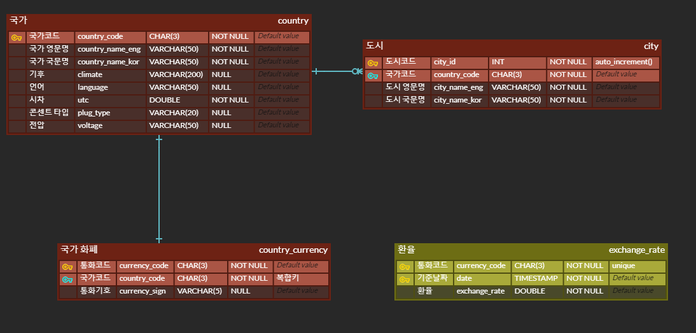
-   유저/인증 서버
    -   mariadb
        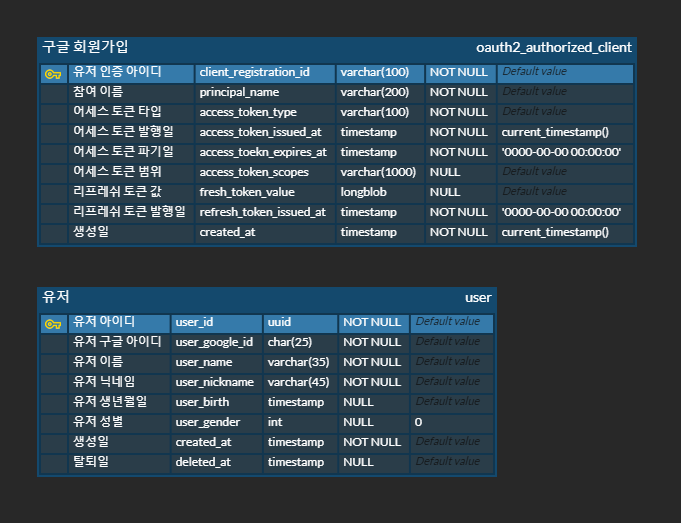
-   여행 관리 서버
    -   neo4j
        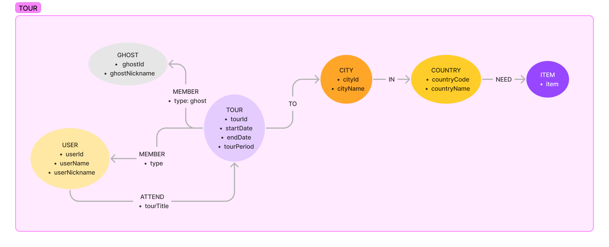
-   체크리스트 서버
    -   neo4j
        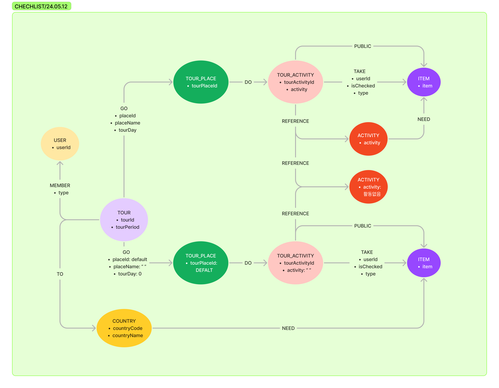
-   일정 서버 (장소, 활동)
    -   neo4j
        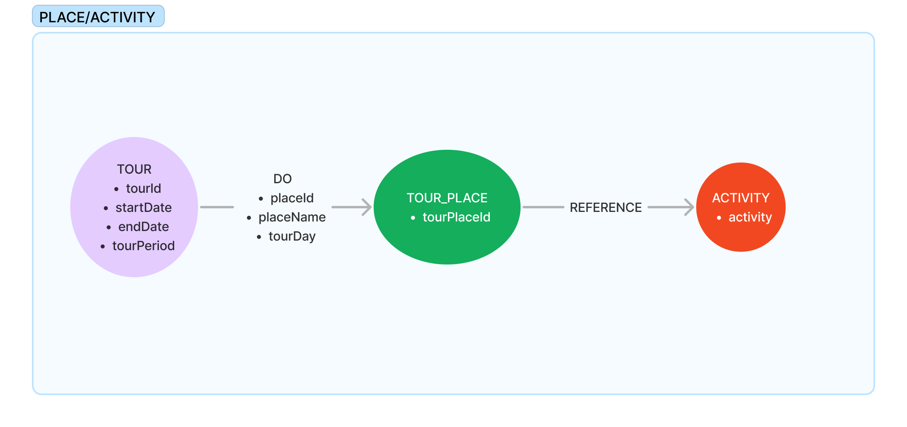
-   가계부 서버
    -   mongoDB collections 구조
        ```json
        _id: String(tourId)
        ~~PublicPayment: List[publicPaymentId, ...]~~
        publicPayment(Map): {
        												publicPaymentId(UUID):
        												{
        												    payAmount: Number,
        												    exchangeRate: Number,
        											      unit: String,
        											      payMethod: String,
        											      payDatetime: Date,
        											      payContent: String,
        											      payCategory: String,
        											      payerId : String(UUID),
        											      payMemberList : [
        												        {
        												            userId: String,
        												            payAmount: Number
        												        }, ...
        												    ]
        												},
        												...
        										}
        privatePayment(Map): {
        												 userId(UUID): {
        												      privatePaymentList: List[
        																			      {
        																						    privatePaymentId: UUID,
        																						    exchangeRate: Number,
        																						    payAmount: Number,
        																					      unit: String,
        																					      payMethod: String,
        																					      payDatetime: Date,
        																					      payContent: String,
        																					      payCategory: String,
        																						},...
        																			],
        															publicPaymentList: [String, ...]
        													}
        ```

## 👨‍👩‍👧‍👧 팀원 소개

### Frontend

-   김태운: 프론트엔드 개발
-   유혜승: UI디자인, 프론트엔드 개발

### Backend

-   김연수: 팀장🤴, 유저, 인증 서버 개발, 인프라 구축
-   김강민: 가계부 서버 개발, 국가 정보 및 활동 데이터 생성
-   이민영: 일정 서버 개발
-   이선재: 여행 관리, 체크리스트 서버 개발
